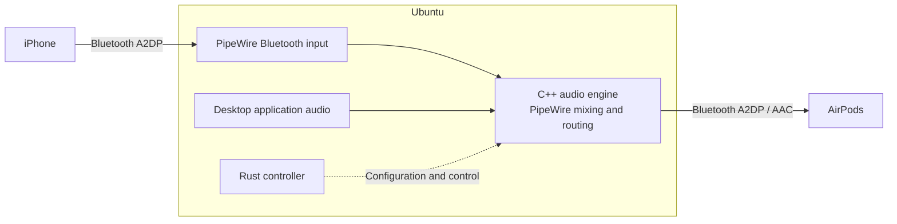

ได้ครับ นี่คือ Markdown ภาษาอังกฤษสำหรับใช้เป็น `PROJECT.md` โดยใช้ชื่อเสนอว่า `bluetooth-audio-bridge` — ยังเป็นเอกสารออกแบบ ไม่ได้สร้างหรือแก้ไขโปรเจกต์ครับ

# Bluetooth Audio Bridge

## 1. Project Overview

Bluetooth Audio Bridge is a Linux application that combines audio from an iPhone and an Ubuntu computer, then sends the mixed audio to a single pair of Bluetooth headphones.

The primary implementation languages are **Rust** and **C++**.

### Required behavior

1. The iPhone connects to Ubuntu through Bluetooth and sends its media audio to Ubuntu.
2. AirPods connect directly to Ubuntu through Bluetooth.
3. Ubuntu mixes the iPhone audio with local desktop audio.
4. AirPods receive both audio sources simultaneously through an A2DP connection using AAC.

The headphones connect to Ubuntu only. They do not need Bluetooth Multipoint or firmware modifications.

**Project status:** Design specification. End-to-end operation on the target hardware remains to be validated.

## 2. Architecture



Solid arrows represent audio flow. The dotted arrow represents application control.

### Bluetooth connections

- **iPhone → Ubuntu:** Ubuntu receives media audio as an A2DP Sink.
- **Ubuntu → AirPods:** Ubuntu transmits mixed audio as an A2DP Source.
- The incoming and outgoing connections negotiate their codecs independently.

WirePlumber supports both A2DP roles and configuration of available Bluetooth codecs. AAC availability depends on the installed audio stack and negotiated device capabilities. [WirePlumber Bluetooth documentation](https://pipewire.pages.freedesktop.org/wireplumber/daemon/configuration/bluetooth.html)

### Audio processing

Incoming Bluetooth audio is decoded to PCM before mixing. Desktop audio and iPhone audio are combined in the PipeWire graph, then encoded for the outgoing headphone connection.

This is not compressed-audio passthrough. The additional receive, buffering, mixing, and transmit stages introduce latency.

## 3. Technology Responsibilities

### Rust: Application Controller

Rust owns the application lifecycle and control logic:

- Configuration loading and validation.
- CLI commands and status reporting.
- Identification of the selected iPhone and headphones.
- Bluetooth connection monitoring.
- Controlled reconnection with bounded backoff.
- Audio-engine lifecycle management.
- Persistence of device selections and volume settings.
- Structured diagnostics and error reporting.
- Communication with the C++ engine.

Bluetooth management uses the existing BlueZ service through D-Bus. The application must not implement its own Bluetooth stack or directly take ownership of the Bluetooth adapter. [BlueZ Device API](https://github.com/bluez/bluez/blob/master/doc/org.bluez.Device.rst)

### C++: Audio Engine

C++ owns integration with the PipeWire audio graph:

- Discovering audio nodes and ports.
- Creating the project’s virtual desktop output.
- Routing the selected iPhone audio separately from desktop audio.
- Controlling independent volume and mute settings.
- Connecting the mixed output to the selected headphones.
- Reporting stream, route, and negotiated-format information.
- Removing project-owned audio objects during shutdown.

Prefer existing PipeWire mixing, resampling, and routing facilities. Add custom PCM processing only when required for gain control or clipping protection.

PipeWire provides native Stream, Filter, and Core APIs suitable for this integration. [PipeWire API](https://docs.pipewire.org/page_api.html)

### Existing System Components

- **BlueZ:** Bluetooth discovery, pairing, connections, and transport management.
- **PipeWire:** Audio transport, codec integration, graph processing, and resampling.
- **WirePlumber:** Audio-session policy and Bluetooth audio-device management.
- **systemd user service:** Optional automatic startup within the user session.

No custom kernel module is required.

## 4. Rust–C++ Boundary

Expose a small C-compatible API from the C++ engine.

Rust sends control operations such as:

- Initialize or shut down the engine.
- Select source and output devices.
- Enable or disable routing.
- Set gain and mute states.
- Read status and error information.

Implementation requirements:

- Use opaque engine handles and explicit ownership.
- Do not allow C++ exceptions or Rust panics to cross the FFI boundary.
- Keep PCM processing within PipeWire/C++.
- Do not send every audio buffer through Rust.
- Keep logging, blocking operations, and dynamic allocation out of real-time callbacks.
- Apply control changes through thread-safe mechanisms.

## 5. Audio Routing Requirements

### Desktop Audio

Create a virtual playback device named:

**Bluetooth Audio Bridge**

The user can select it as the output for individual applications or explicitly choose it as the desktop default.

Do not silently change the system default output.

### iPhone Audio

Route the selected iPhone stream into the bridge exactly once.

Prevent WirePlumber’s automatic playback routing and the project’s routing from producing duplicate playback.

Never capture the bridge’s own mixed output back into its input.

PipeWire supports source-to-sink routing and virtual audio devices through its loopback facilities. [PipeWire Loopback](https://docs.pipewire.org/page_module_loopback.html)

### Headphone Output

- Target the selected AirPods, not whichever output happens to be the default.
- Prefer A2DP with AAC.
- Report the actual negotiated codec when available.
- Do not claim AAC is active merely because it is configured.
- If AAC is required but unavailable, report the condition clearly.
- Allow another codec only through an explicit fallback setting.
- Never switch to HFP automatically to resolve a media-routing problem.

### Volume and Clipping

Provide independent controls for:

- iPhone volume.
- Desktop volume.
- Master output volume.
- Per-source mute.

Use conservative initial gain and clipping protection. Changing bridge gain must not unexpectedly change unrelated application or hardware volume settings.

## 6. Connection and Recovery Behavior

- Pairing is performed explicitly by the user.
- Automatically reconnect only configured, previously paired devices.
- Do not automatically trust nearby devices or leave Bluetooth discoverable indefinitely.
- Track Bluetooth connection state separately from audio-stream readiness.
- Rebuild audio routes after device or PipeWire reconnection.
- Resolve devices using stable identity information rather than saved PipeWire node IDs.

### Failure Handling

- **iPhone disconnects:** Desktop audio continues through the headphones.
- **iPhone pauses playback:** Treat it as idle, not as a connection failure.
- **Headphones disconnect:** Keep the virtual device available, but stop forwarding audio.
- **Headphones reconnect:** Restore one valid route without creating duplicate streams.
- **PipeWire becomes unavailable:** Wait and reconnect; do not restart system audio services.

Do not redirect private phone audio to physical speakers when the headphones disappear.

## 7. Existing Virtual Microphone Compatibility

The existing AirPods virtual microphone is a separate subsystem.

This project must not automatically:

- Replace the default microphone.
- Stop or restart the existing microphone service.
- Modify its configuration.
- Route mixed playback audio into the microphone.
- Enable sidetone or microphone monitoring.

Simultaneous operation with the virtual microphone must be validated separately because it adds Bluetooth traffic and audio-processing load.

## 8. Proposed Repository Structure

```text
bluetooth-audio-bridge/
├── Cargo.toml
├── crates/
│   ├── daemon/
│   │   └── src/
│   │       ├── main.rs
│   │       ├── config.rs
│   │       ├── bluetooth.rs
│   │       └── controller.rs
│   ├── cli/
│   │   └── src/
│   │       └── main.rs
│   └── audio-ffi/
│       ├── build.rs
│       └── src/
│           └── lib.rs
├── native/
│   └── audio-engine/
│       ├── CMakeLists.txt
│       ├── include/
│       │   └── bridge_audio.h
│       └── src/
│           ├── engine.cpp
│           └── routing.cpp
├── config/
│   └── default.toml
├── systemd/
│   └── bluetooth-audio-bridge.service
├── scripts/
│   ├── build.sh
│   ├── install.sh
│   └── uninstall.sh
├── PROJECT.md
└── README.md
```

Use Cargo for Rust and CMake for the C++ library. The FFI crate integrates the native library into the Rust build.

## 9. Proposed Configuration

The following schema is illustrative and is not yet implemented:

```toml
[devices]
iphone_address = "<paired iPhone address>"
headphones_address = "<paired AirPods address>"

[audio]
virtual_sink_name = "bluetooth-audio-bridge"
output_codec = "aac"
allow_codec_fallback = false
phone_gain = 0.5
desktop_gain = 0.5
master_gain = 1.0
headphone_disconnect_action = "silence"

[connection]
auto_reconnect = true
retry_initial_seconds = 1
retry_max_seconds = 30
```

Store configuration and runtime state using the appropriate XDG user directories.

Detect the installed PipeWire and WirePlumber versions before generating integration configuration. Do not assume that configuration syntax is interchangeable between versions.

## 10. Installation and Removal

### Installation

- Run the application as the desktop user, not as root.
- Install only project-owned binaries, configuration, and user-service files.
- Document any required operating-system dependencies.
- Require explicit approval before changing Bluetooth or audio-session policy.
- Do not replace or rebuild the system Bluetooth/audio stack.

### Uninstallation

- Remove project-owned audio nodes and routes.
- Remove the application’s service, binaries, configuration, and state.
- Preserve Bluetooth pairings and unrelated audio configuration.
- Restore previous defaults only if the current defaults still point to the bridge.
- Do not overwrite audio choices the user made after installation.

## 11. MVP Acceptance Criteria

The MVP is complete only after functional validation confirms:

1. The iPhone sends media audio to Ubuntu through Bluetooth.
2. AirPods remain connected directly to Ubuntu.
3. Distinct audio from the iPhone and desktop is audible simultaneously.
4. The outgoing AirPods transport actually uses AAC.
5. Independent volume and mute controls work.
6. Disconnecting the iPhone does not interrupt desktop audio.
7. Reconnecting either device does not create duplicate playback.
8. Losing the headphones does not send phone audio to speakers.
9. The existing virtual microphone can coexist without unintended profile changes.
10. Installation and removal preserve unrelated system configuration.

Build success alone is not evidence of end-to-end audio correctness. Hardware and listening checks must be performed explicitly.

## 12. Limitations and Non-Goals

The first version does not include:

- Cellular call or FaceTime audio bridging.
- Forwarding the AirPods microphone back to the iPhone.
- Headphone firmware modifications.
- Bluetooth Multipoint emulation inside the headphones.
- Custom AAC codec implementation.
- Custom kernel drivers.
- Audio recording or cloud streaming.
- A graphical interface.

The computer must remain powered on and connected while acting as the bridge.

A single Bluetooth adapter may be sufficient, but simultaneous receive/transmit stability must be measured on the target hardware. Do not promise zero latency or guaranteed compatibility with every adapter.

The core deliverable is a **Rust-controlled, C++/PipeWire-integrated audio bridge** that preserves A2DP/AAC headphone playback while combining iPhone and Ubuntu media audio.