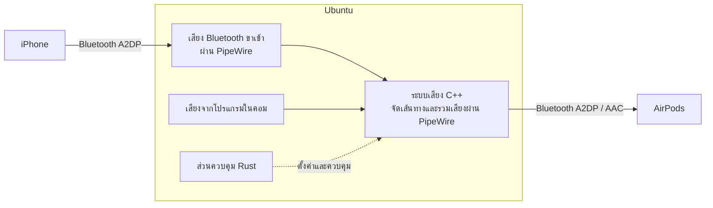

# BT Audio Bridge

## 1. ภาพรวมโปรเจกต์

BT Audio Bridge เป็นแอปพลิเคชันบน Linux สำหรับรวมเสียงจาก iPhone และคอมพิวเตอร์ Ubuntu แล้วส่งเสียงที่รวมแล้วไปยังหูฟัง Bluetooth คู่เดียว

ใช้ **Rust** และ **C++** เป็นภาษาหลักในการพัฒนา

### การทำงานที่ต้องการ

1. iPhone เชื่อมต่อ Bluetooth กับ Ubuntu และส่งเสียงเพลงหรือวิดีโอเข้ามายังคอม
2. AirPods เชื่อมต่อ Bluetooth กับ Ubuntu โดยตรง
3. Ubuntu รวมเสียงจาก iPhone กับเสียงของโปรแกรมที่ทำงานในคอม
4. AirPods ได้รับเสียงจากทั้งสองแหล่งพร้อมกันผ่าน A2DP โดยใช้ codec AAC

หูฟังเชื่อมต่อกับ Ubuntu เท่านั้น ไม่จำเป็นต้องรองรับ Bluetooth Multipoint และไม่ต้องแก้ไข firmware ของหูฟัง

**สถานะโปรเจกต์:** เอกสารออกแบบ ยังไม่ได้ยืนยันการทำงานครบทั้งระบบบนฮาร์ดแวร์เป้าหมาย

## 2. สถาปัตยกรรมระบบ



เส้นทึบแสดงเส้นทางเสียง ส่วนเส้นประแสดงการควบคุมการทำงาน

### การเชื่อมต่อ Bluetooth

- **iPhone → Ubuntu:** Ubuntu รับเสียงในบทบาท A2DP Sink
- **Ubuntu → AirPods:** Ubuntu ส่งเสียงที่รวมแล้วในบทบาท A2DP Source
- การเชื่อมต่อขาเข้าและขาออกเลือก codec แยกกัน

WirePlumber รองรับบทบาท A2DP ทั้งสองแบบและการกำหนด codec ของ Bluetooth แต่การใช้ AAC ได้จริงขึ้นอยู่กับระบบเสียงที่ติดตั้งและความสามารถที่อุปกรณ์ตกลงใช้ร่วมกัน [เอกสาร Bluetooth ของ WirePlumber](https://pipewire.pages.freedesktop.org/wireplumber/daemon/configuration/bluetooth.html)

### การประมวลผลเสียง

เสียง Bluetooth ขาเข้าจะถูกถอดรหัสเป็น PCM ก่อนนำมารวมกับเสียงจากโปรแกรมในคอม จากนั้นจึงเข้ารหัสใหม่สำหรับส่งออกไปยังหูฟัง

กระบวนการนี้ไม่ใช่การส่งต่อข้อมูลเสียงบีบอัดแบบเดิมโดยตรง การรับเสียง การพักข้อมูลใน buffer การรวมเสียง และการส่งออก จะเพิ่มความหน่วงให้ระบบ

## 3. การแบ่งหน้าที่ของเทคโนโลยี

### Rust: ส่วนควบคุมแอปพลิเคชัน

Rust รับผิดชอบวงจรการทำงานและตรรกะควบคุม ได้แก่:

- อ่านและตรวจสอบ configuration
- ให้บริการคำสั่ง CLI และรายงานสถานะ
- ระบุ iPhone และหูฟังที่ผู้ใช้เลือก
- ติดตามสถานะการเชื่อมต่อ Bluetooth
- เชื่อมต่อใหม่โดยเว้นระยะระหว่างความพยายามและกำหนดระยะสูงสุด
- จัดการวงจรการทำงานของระบบเสียง C++
- บันทึกอุปกรณ์ที่เลือกและค่าระดับเสียง
- รายงานข้อผิดพลาดและข้อมูลวิเคราะห์ปัญหา
- ติดต่อกับระบบเสียง C++ ผ่าน FFI

การจัดการ Bluetooth ใช้บริการ BlueZ ที่มีอยู่ผ่าน D-Bus ไม่สร้าง Bluetooth stack ใหม่ และไม่เข้าควบคุมอะแดปเตอร์แทน BlueZ โดยตรง [BlueZ Device API](https://github.com/bluez/bluez/blob/master/doc/org.bluez.Device.rst)

### C++: ระบบจัดการเสียง

C++ รับผิดชอบการเชื่อมต่อกับกราฟเสียงของ PipeWire ได้แก่:

- ค้นหา audio node และ port
- สร้างอุปกรณ์เสียงออกเสมือนของโปรเจกต์
- แยกเส้นทางเสียง iPhone ออกจากเสียงโปรแกรมในคอม
- ควบคุมระดับเสียงและการปิดเสียงของแต่ละแหล่ง
- เชื่อมเสียงที่รวมแล้วไปยังหูฟังที่เลือก
- รายงานสถานะ stream เส้นทางเสียง และรูปแบบเสียงที่ใช้งานจริง
- ลบ audio object ที่โปรเจกต์สร้างเมื่อปิดการทำงาน

ใช้ความสามารถด้านการรวมเสียง การปรับอัตราสุ่มเสียง และการจัดเส้นทางของ PipeWire เป็นหลัก เพิ่มการประมวลผล PCM เองเฉพาะเมื่อจำเป็น เช่น การควบคุม gain หรือป้องกันเสียง clipping

PipeWire มี Stream, Filter และ Core API สำหรับงานเหล่านี้ [PipeWire API](https://docs.pipewire.org/page_api.html)

### ส่วนประกอบของระบบที่ใช้งานร่วมกัน

- **BlueZ:** ค้นหาอุปกรณ์ จับคู่ เชื่อมต่อ และจัดการ Bluetooth transport
- **PipeWire:** รับส่งเสียง เชื่อมต่อ codec ประมวลผลกราฟเสียง และปรับอัตราสุ่มเสียง
- **WirePlumber:** จัดการนโยบายระบบเสียงและอุปกรณ์เสียง Bluetooth
- **systemd user service:** เริ่มแอปพลิเคชันอัตโนมัติใน session ของผู้ใช้เมื่อเลือกเปิดใช้งาน

ไม่จำเป็นต้องสร้าง kernel module เพิ่ม

## 4. การเชื่อมต่อระหว่าง Rust กับ C++

ให้ระบบเสียง C++ เปิด API ขนาดเล็กที่เรียกผ่าน C ABI ได้

Rust ส่งคำสั่งควบคุม เช่น:

- เริ่มต้นหรือปิดระบบเสียง
- เลือกอุปกรณ์ต้นทางและปลายทาง
- เปิดหรือปิดเส้นทางเสียง
- ตั้งค่า gain และ mute
- อ่านสถานะและข้อผิดพลาด

### ข้อกำหนดในการพัฒนา

- ใช้ opaque handle และกำหนดผู้รับผิดชอบอายุของ object ให้ชัดเจน
- ห้ามปล่อย C++ exception หรือ Rust panic ข้ามขอบเขต FFI
- ให้การประมวลผล PCM อยู่ในฝั่ง PipeWire/C++
- ไม่ส่ง audio buffer ทุกก้อนผ่าน Rust
- ไม่ทำงานที่อาจรอค้าง เขียน log หรือจองหน่วยความจำแบบ dynamic ภายใน real-time callback
- ส่งการเปลี่ยนค่าควบคุมผ่านกลไกที่ปลอดภัยต่อการทำงานหลาย thread

## 5. ข้อกำหนดการจัดเส้นทางเสียง

### เสียงจากโปรแกรมในคอม

สร้างอุปกรณ์เสียงออกเสมือนชื่อ:

**BT Audio Bridge**

ผู้ใช้สามารถเลือกอุปกรณ์นี้เป็นเสียงออกของโปรแกรมบางตัว หรือเลือกให้เป็นอุปกรณ์เสียงออกหลักของคอมได้

ห้ามเปลี่ยนอุปกรณ์เสียงออกหลักของระบบโดยอัตโนมัติโดยที่ผู้ใช้ไม่ได้เลือก

### เสียงจาก iPhone

นำเสียงจาก iPhone ที่เลือกเข้าสู่ bridge เพียงเส้นทางเดียว

ต้องป้องกันไม่ให้เส้นทางอัตโนมัติของ WirePlumber และเส้นทางที่โปรเจกต์สร้างทำให้เกิดเสียงเล่นซ้ำ

ห้ามนำเสียงรวมขาออกของ bridge กลับเข้าขาเข้าของตัวเอง เพราะจะทำให้เกิดวงจรเสียงย้อนกลับ

PipeWire รองรับการเชื่อม source เข้ากับ sink และการสร้างอุปกรณ์เสียงเสมือนผ่านระบบ loopback [PipeWire Loopback](https://docs.pipewire.org/page_module_loopback.html)

### เสียงออกไปยังหูฟัง

- ส่งเสียงไปยัง AirPods ที่ผู้ใช้เลือก ไม่ใช่อุปกรณ์ใดก็ตามที่เป็น default
- เลือกใช้ A2DP พร้อม AAC เป็นหลัก
- รายงาน codec ที่ใช้งานจริงเมื่ออ่านค่าได้
- ห้ามรายงานว่าใช้ AAC เพียงเพราะ configuration ระบุ AAC
- หากกำหนดว่าต้องใช้ AAC แต่ใช้งานไม่ได้ ให้รายงานสาเหตุอย่างชัดเจน
- ใช้ codec อื่นแทนได้เฉพาะเมื่อผู้ใช้เปิด fallback ไว้
- ห้ามสลับไป HFP โดยอัตโนมัติเพื่อแก้ปัญหาการส่งเสียงเพลงหรือวิดีโอ

### ระดับเสียงและการป้องกัน Clipping

มีตัวควบคุมแยกสำหรับ:

- ระดับเสียงจาก iPhone
- ระดับเสียงจากโปรแกรมในคอม
- ระดับเสียงรวมขาออก
- การ mute แต่ละแหล่งเสียง

กำหนด gain เริ่มต้นอย่างระมัดระวังและมีการป้องกัน clipping เมื่อรวมเสียง

การปรับ gain ของ bridge ต้องไม่เปลี่ยนระดับเสียงของโปรแกรมหรือฮาร์ดแวร์อื่นโดยไม่ตั้งใจ

## 6. การเชื่อมต่อและการกู้คืนเมื่อขาดการเชื่อมต่อ

- ผู้ใช้เป็นผู้สั่งจับคู่อุปกรณ์อย่างชัดเจน
- เชื่อมต่อใหม่อัตโนมัติเฉพาะอุปกรณ์ที่กำหนดไว้และเคยจับคู่แล้ว
- ไม่ตั้งให้อุปกรณ์ใกล้เคียงเป็น trusted โดยอัตโนมัติ
- ไม่เปิดโหมด discoverable ค้างไว้อย่างไม่มีกำหนด
- แยกสถานะการเชื่อมต่อ Bluetooth ออกจากสถานะความพร้อมของ audio stream
- สร้างเส้นทางเสียงใหม่เมื่ออุปกรณ์หรือ PipeWire กลับมาเชื่อมต่อ
- ระบุอุปกรณ์ด้วยข้อมูลประจำตัวที่เหมาะสม ไม่บันทึก PipeWire node ID มาใช้ข้ามการเชื่อมต่อ

### พฤติกรรมเมื่อเกิดปัญหา

- **iPhone หลุด:** เสียงจากคอมยังต้องออกหูฟังได้
- **iPhone หยุดเล่นเสียง:** ถือว่าไม่มีเสียงเข้าชั่วคราว ไม่ใช่การเชื่อมต่อล้มเหลว
- **หูฟังหลุด:** คงอุปกรณ์เสียงเสมือนไว้ แต่หยุดส่งเสียงออก
- **หูฟังเชื่อมต่อใหม่:** คืนเส้นทางเสียงที่ถูกต้องเพียงชุดเดียว ไม่สร้าง stream ซ้ำ
- **PipeWire ใช้งานไม่ได้:** รอและเชื่อมต่อใหม่ โดยไม่รีสตาร์ตบริการเสียงของระบบเอง

ห้ามเปลี่ยนไปเล่นเสียงจากโทรศัพท์ผ่านลำโพงจริงโดยอัตโนมัติเมื่อหูฟังหลุด

## 7. การทำงานร่วมกับ Virtual Microphone เดิม

Virtual microphone ของ AirPods ที่ใช้งานอยู่เป็นระบบแยกต่างหาก

โปรเจกต์นี้ต้องไม่ดำเนินการต่อไปนี้โดยอัตโนมัติ:

- เปลี่ยนไมโครโฟนหลักของระบบ
- หยุดหรือรีสตาร์ตบริการ virtual microphone เดิม
- แก้ไข configuration ของระบบไมโครโฟนเดิม
- ส่งเสียงรวมของ bridge เข้าไปยังไมโครโฟน
- เปิดการฟังเสียงไมค์ตัวเองหรือ microphone monitoring

ต้องทดสอบการใช้งานพร้อมกับ virtual microphone แยกต่างหาก เพราะทำให้มีข้อมูลผ่าน Bluetooth และภาระประมวลผลเสียงเพิ่มขึ้น

## 8. โครงสร้าง Repository ที่เสนอ

```text
bt-audio-bridge/
├── Cargo.toml
├── crates/
│   ├── daemon/
│   │   └── src/
│   │       ├── main.rs
│   │       ├── config.rs
│   │       ├── bluetooth.rs
│   │       └── controller.rs
│   ├── cli/
│   │   └── src/
│   │       └── main.rs
│   └── audio-ffi/
│       ├── build.rs
│       └── src/
│           └── lib.rs
├── native/
│   └── audio-engine/
│       ├── CMakeLists.txt
│       ├── include/
│       │   └── bridge_audio.h
│       └── src/
│           ├── engine.cpp
│           └── routing.cpp
├── config/
│   └── default.toml
├── systemd/
│   └── bt-audio-bridge.service
├── scripts/
│   ├── build.sh
│   ├── install.sh
│   └── uninstall.sh
├── PROJECT.md
└── README.md
```

ใช้ Cargo สำหรับ Rust และ CMake สำหรับไลบรารี C++

Crate `audio-ffi` ทำหน้าที่เชื่อมไลบรารี C++ เข้ากับกระบวนการ build ของ Rust

## 9. Configuration ที่เสนอ

ตัวอย่างต่อไปนี้เป็นรูปแบบ configuration ที่เสนอ ยังไม่ได้พัฒนาให้ใช้งานจริง:

```toml
[devices]
iphone_address = "<paired iPhone address>"
headphones_address = "<paired AirPods address>"

[audio]
virtual_sink_name = "bt-audio-bridge"
output_codec = "aac"
allow_codec_fallback = false
phone_gain = 0.5
desktop_gain = 0.5
master_gain = 1.0
headphone_disconnect_action = "silence"

[connection]
auto_reconnect = true
retry_initial_seconds = 1
retry_max_seconds = 30
```

เก็บ configuration และข้อมูลสถานะในตำแหน่งของผู้ใช้ตามมาตรฐาน XDG

ตรวจสอบเวอร์ชัน PipeWire และ WirePlumber ที่ติดตั้งก่อนสร้าง configuration สำหรับเชื่อมต่อระบบ ห้ามถือว่ารูปแบบ configuration ของแต่ละเวอร์ชันใช้แทนกันได้เสมอ

## 10. การติดตั้งและถอนการติดตั้ง

### การติดตั้ง

- รันแอปพลิเคชันด้วยผู้ใช้ desktop ไม่ใช่ root
- ติดตั้งเฉพาะ binary, configuration และ user service ของโปรเจกต์
- ระบุ dependency ของระบบปฏิบัติการให้ชัดเจน
- ขออนุญาตก่อนเปลี่ยนนโยบาย Bluetooth หรือระบบเสียง
- ไม่ติดตั้งทับหรือ build ทับ Bluetooth stack และระบบเสียงของเครื่อง

### การถอนการติดตั้ง

- ลบ audio node และเส้นทางเสียงที่โปรเจกต์สร้าง
- ลบ service, binary, configuration และข้อมูลสถานะของแอปพลิเคชัน
- ไม่ลบข้อมูลจับคู่ Bluetooth หรือ configuration เสียงที่ไม่เกี่ยวข้อง
- คืนค่า default เดิมเฉพาะเมื่อค่า default ปัจจุบันยังชี้มาที่ bridge
- ไม่เขียนทับการตั้งค่าเสียงที่ผู้ใช้เปลี่ยนเองหลังติดตั้งโปรเจกต์

## 11. เกณฑ์ยอมรับสำหรับ MVP

MVP ถือว่าเสร็จเมื่อผ่านการตรวจสอบการทำงานจริงดังนี้:

1. iPhone ส่งเสียงเพลงหรือวิดีโอเข้ามายัง Ubuntu ผ่าน Bluetooth ได้
2. AirPods ยังคงเชื่อมต่อกับ Ubuntu โดยตรง
3. ได้ยินเสียงที่แตกต่างกันจาก iPhone และคอมพร้อมกันจริง
4. การเชื่อมต่อขาออกไปยัง AirPods ใช้ AAC จริง
5. ปรับระดับเสียงและ mute แต่ละแหล่งได้อย่างอิสระ
6. เมื่อ iPhone หลุด เสียงจากคอมยังทำงานต่อได้
7. การเชื่อมต่ออุปกรณ์ใหม่ไม่ทำให้เกิดเสียงเล่นซ้ำ
8. เมื่อหูฟังหลุด เสียงโทรศัพท์ไม่เปลี่ยนไปออกลำโพงจริง
9. ใช้งานร่วมกับ virtual microphone เดิมได้โดยไม่เปลี่ยน Bluetooth profile อย่างไม่ตั้งใจ
10. การติดตั้งและถอนการติดตั้งไม่กระทบ configuration อื่นของระบบ

การ build ผ่านเพียงอย่างเดียวไม่ถือเป็นหลักฐานว่าระบบเสียงทำงานครบถ้วน ต้องมีการตรวจฮาร์ดแวร์และทดลองฟังจริงอย่างชัดเจน

## 12. ข้อจำกัดและสิ่งที่ไม่อยู่ในขอบเขต

เวอร์ชันแรกไม่รวม:

- การส่งต่อเสียงสายโทรศัพท์หรือ FaceTime
- การส่งเสียงไมค์ AirPods กลับไปยัง iPhone
- การแก้ไข firmware ของหูฟัง
- การจำลอง Bluetooth Multipoint ภายในหูฟัง
- การเขียน AAC codec ใหม่
- การสร้าง kernel driver ใหม่
- การบันทึกเสียงหรือส่งเสียงขึ้น cloud
- หน้าจอควบคุมแบบ GUI

คอมพิวเตอร์ต้องเปิดและเชื่อมต่ออยู่ระหว่างทำหน้าที่เป็นตัวกลางรวมเสียง

อะแดปเตอร์ Bluetooth ตัวเดียวอาจเพียงพอ แต่ต้องทดสอบความเสถียรในการรับและส่งเสียงพร้อมกันบนฮาร์ดแวร์จริง ห้ามรับประกันว่าไม่มีความหน่วงหรือใช้งานได้กับอะแดปเตอร์ทุกรุ่น

ผลลัพธ์หลักของโปรเจกต์คือ **ระบบรวมเสียงที่ควบคุมด้วย Rust และเชื่อมต่อระบบเสียงผ่าน C++/PipeWire** โดยยังคงส่งเสียงไปยังหูฟังด้วย A2DP/AAC พร้อมรวมเสียงจาก iPhone และ Ubuntu ให้ได้ยินพร้อมกัน
